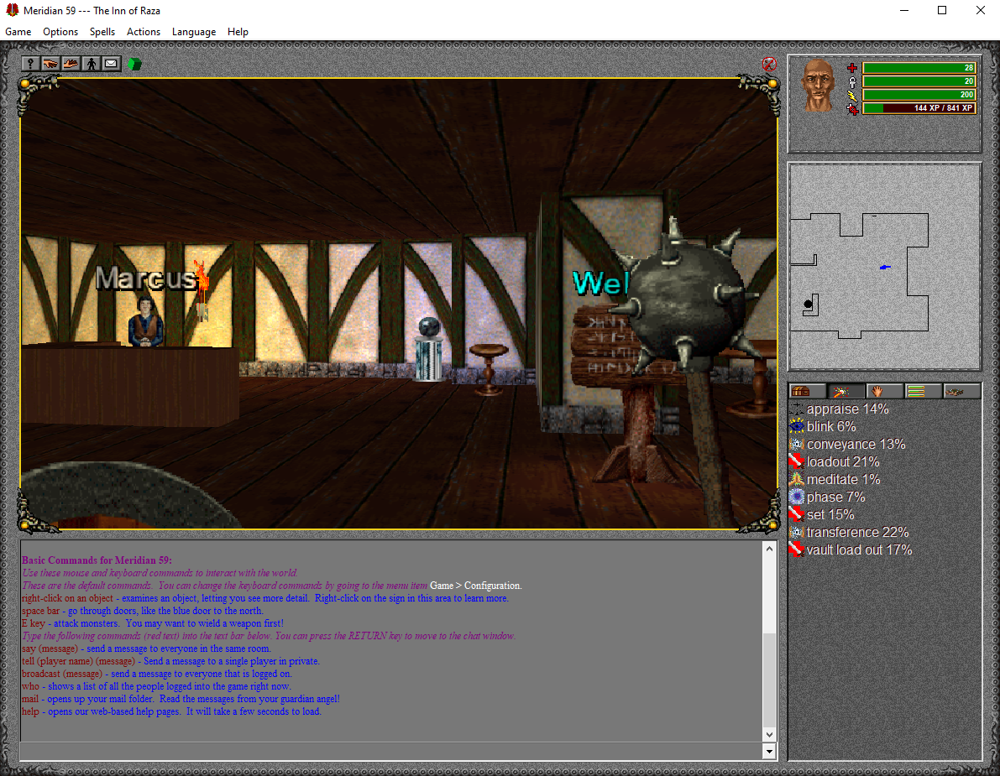
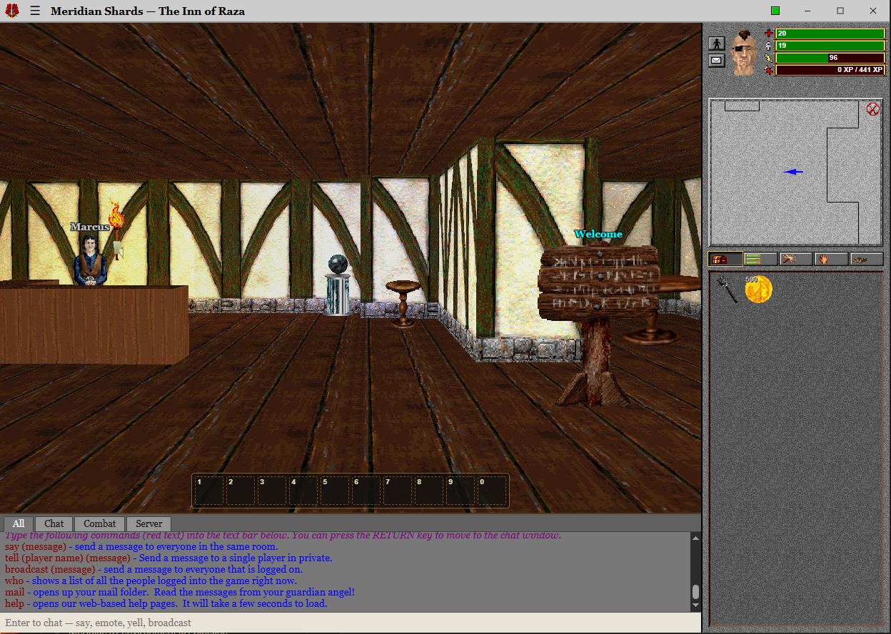
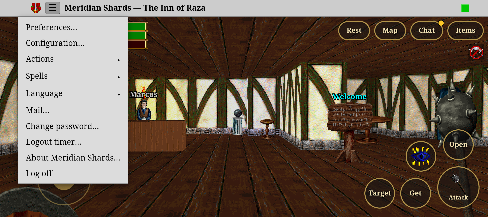
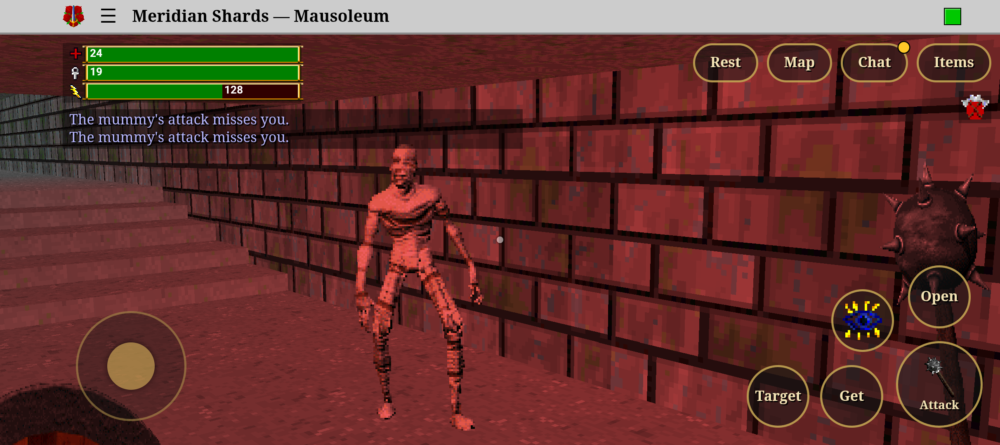

# Meridian Shards

A faithful port of the classic Meridian 59 client to the desktop (Windows, macOS and Linux) and, in progress, Android: the original 2.5D look, sprites and textures, rendered with WebGL at modern resolutions, with modern controls beside the original ones. It connects to our own server, which runs the original Server 104 server code unchanged. Every server is a "shard" of one original universe.

## Screenshots

The Inn of Raza in the original Windows client (left) and in Meridian Shards on the desktop (right):

<table>
  <tr>
    <td width="50%"></td>
    <td width="50%"></td>
  </tr>
  <tr>
    <td align="center">The original client</td>
    <td align="center">Meridian Shards (desktop)</td>
  </tr>
</table>

On an Android phone, with the touch controls, the ☰ menu open, and a fight in the Mausoleum:





## Status

The client does what the original client and its modules do. What's still missing is listed, with the original's source for each, in [docs/missing-features.md](docs/missing-features.md).

- **The world:** every room drawn as the original D3D client draws it, with its lighting, sky, sun and moon, weather, and rooms that change (lifts, doors, the Raza clock). Objects, players and monsters are drawn, lit and animated, with blur, waver and flashing effects. Walking uses the original's movement code, so original clients see our moves.
- **Playing:**
  - fighting with a weapon in hand, casting spells (with a Spells menu by school), dying and leaving the Underworld;
  - looking at things, picking up and dropping, containers, trading with players, shops, the bank and the vault;
  - chat with tabs (All, Chat, Combat, Server), tells, groups, emotes and moods, and the original's typed commands and aliases;
  - mail, the news globes, guilds, stat reallocation, chess, and the original's full character creator.
- **The interface:** the original's column (bars, face, enchantments, minimap with notes, the inventory, stats, spells, skills and quests tabs), toolbar, cursors, stone borders, and its Preferences, Configuration (key bindings) and Actions windows. The controls come in a modern (WASD, mouselook) preset and the original's keys. There's also a profanity filter, a logout timer, a language choice (English, German, Portuguese) and the splash screen.
- **Ours on top:** damage numbers, chat tabs, a latency meter, and pixel-accurate clicking.
- **For staff:** an in-game admin console for admin accounts ([docs/admin-console.md](docs/admin-console.md)).
- **Where to play:** with the desktop app for Windows, macOS and Linux, released on [GitHub](https://github.com/jboullion/meridian-shards/releases) (it updates itself), on our hosted server. The client is built with web technology, so it also runs in a browser against a local server, for development; the hosted server doesn't offer browser play.
- **Mac and Linux players:** the original client has only ever been a Windows program, so playing on a Mac or on Linux has meant running it under Wine or a virtual machine. Meridian Shards runs natively there, with the macOS (universal) and Linux (AppImage, deb) builds of the desktop app. Those builds come out of CI with every release, but they haven't been tried on real Mac and Linux machines yet, so reports are welcome.
- **Android (in progress):** an Android app is on the way. It already runs in the emulator against the local server; the phone layout, touch controls and a release build are next ([ADR 0003](docs/adr/0003-android.md)).

The milestones and their progress are in [docs/roadmap.md](docs/roadmap.md).

## Quick start (Windows, local)

Requirements: Node 24+ and Visual Studio 2026 with the C++ x86 toolset.

```bash
npm install
server\build.cmd          # build blakserv, the Kod and rsc0000.rsb from server\src
server\setup-run.cmd      # prepare server\src\run\server and install our config
npm run assets            # copy the original game files into dist/assets (never committed)
npm run dev               # blakserv + gateway + Vite; open http://localhost:5173 and log in
```

- `npm run assets` reads the art and sounds from an installed Server 104 client (`%LOCALAPPDATA%\Meridian-104`). Run it again after pulling changes that add interface files.
- `server\src` is a git-ignored copy of the Server 104 source. Copy it from `meridian-unreal\Server-104` (for example with `robocopy <that folder> server\src /E /XD run .vs`).
- The local test accounts are `shardbot`, `shardpal` and the admin `shardadmin` (password = name); [AGENTS.md](AGENTS.md) says how to make them on a fresh server.

Other commands:

```bash
npm run check             # typecheck, lint and tests
npm run desktop           # the dev stack plus the desktop app
npm run desktop:dist      # desktop installers for this OS
npm run android           # build the Android app and run it on a phone or the emulator
npm run headless -- --user shardbot --pass shardbot --stay 10   # a scripted client
```

The room viewer is at http://localhost:5173/?viewer. The desktop app also takes the original client's command line (`/U:name /W:password /Q` to log straight in).

## Docs

- [AGENTS.md](AGENTS.md): rules, layout, conventions, and how to test things on our server
- [docs/roadmap.md](docs/roadmap.md): milestones and progress
- [docs/missing-features.md](docs/missing-features.md): what the original has that we don't yet, and what's different on purpose
- [docs/admin-console.md](docs/admin-console.md): using the in-game admin console
- [docs/research/protocol.md](docs/research/protocol.md): the client/server protocol, with source references
- Decisions: [the direction](docs/adr/0001-direction.md), [the desktop app](docs/adr/0002-desktop-shell.md), [the Android app](docs/adr/0003-android.md)
- [deploy/README.md](deploy/README.md): running the hosted server

## Licence

GPLv2 (see [LICENSE](LICENSE)), like the Meridian 59 source it ports. The game's art, music and rooms are not part of this repository.

Meridian is a registered trademark of its owners; this is a non-commercial fan project.
