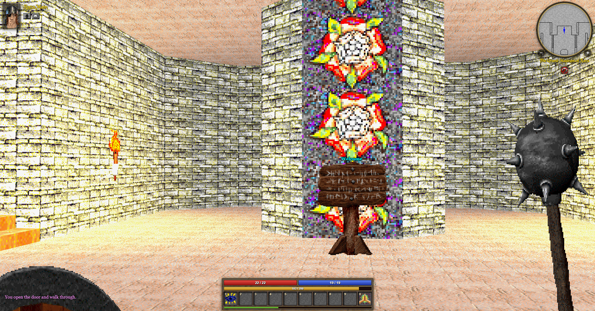
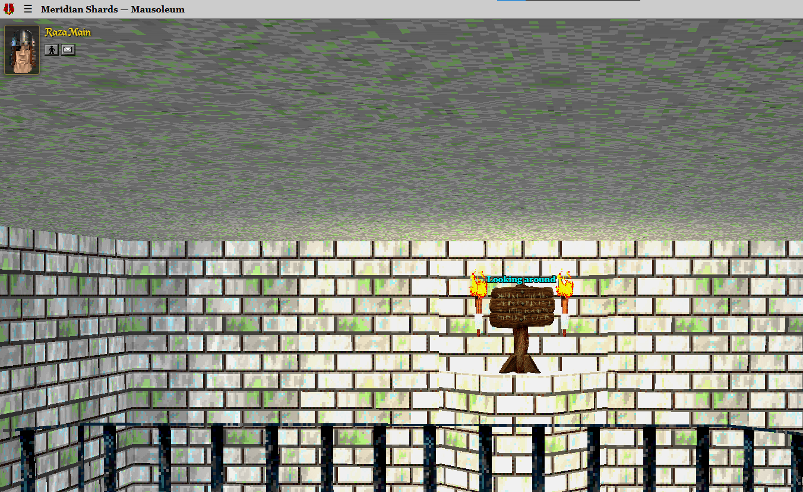

# TODOs and Branstorming

## Current TODOS

- Some torches seem very bright. Could you investigate the light sources in The Grand Museum of Raza and the torches in the Mausoleum in raza to see what could be causing this?

## Releases

## UI

## Modern UI

- Could we attempt to enable some post processing or other effects which make meridian look nicer?
  - Perhaps just to a whole suite of experiements and see what looks good!

## Classic UI

## Mobile UI

## Interactions

## Publish / Package

## Actions
- 